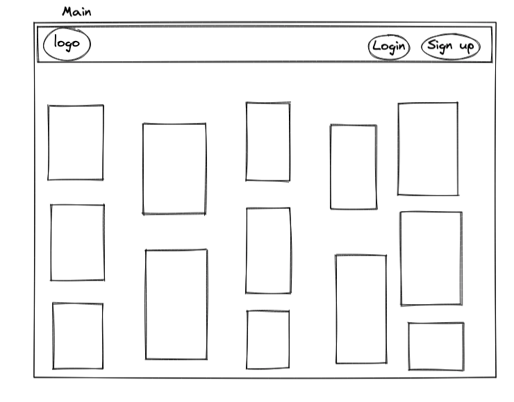

# Honey&Thyme

### Overview
My final project for the Software Engineering Immersive course was a complex full-stack application built with Django REST Framework and React.
I worked alongside my partner [Esin](https://github.com/EsinYilmazbilek) and we created a Pinterest clone of cocktails.


### Deployment
The app was deployed with Heroku on the backend and netlify on the frontend. The deployed application can be found here: [DeployedApp](https://honey-thyme.netlify.app)

### Getting Started
Click the Code button above to download the source code. In the terminal, enter the following commands:
 * To install all the dependencies listed in the package.json: `npm i` 
* Navigate into the shell `pipenv shell`
* Run the app on localhost:8000 : `python manage.py runserver`
* Check the console for any issues and if there are any then check the package.json for any dependencies missing
*  Navigate to http://localhost:8000

### Brief
Build a full-stack application by making your own backend and frontend using Python Django API for the backend. Must use Django REST Framework to serve data from Postgres database and React on the frontend.
* **Timeframe:** 1 week

### Technologies Used:
* Django
* Django REST Framework
* PostgreSQL
* Python
* PyJWT
* JavaScript (ES6)
* React.js
* HTML, CSS, Sass
* Bootstrap
* Axios
* Git + GitHub
* React-router-dom
* React-masonry-component

### Functionality
* Register and Login
* View a show page of cocktails
* Search for cocktails
* Save cocktails to profile
* Comment on cocktails

### Process
#### Planning
We began the design process by planning. Firstly, my partner and I sketched out an Entity Relationship Diagram for the database architecture.


When we were happy with the ERD, We mapped out our project MVP and stretch goals 


We then created wireframes to give an idea of how the page components should generally look like we moved on to the build.




#### Work Split
My partner and I worked together continuously throughout the project and did not have formal work splits as we found it easier to work through function challenges together.

#### Build
We began the development process by building models, views and serialisers in Django REST Framework to create a SQL database with RESTful features.
We spent a day building the models and testing them on insomnia to ensure that the relationships were working as expected and were fit for the functionalities we wanted.

``` Python
class Cocktail(models.Model):
    ''' Cocktail Model '''
    name = models.CharField(max_length=50)
    image = models.CharField(max_length=200)
    about = models.TextField(max_length=300)
    serves = models.PositiveIntegerField()
    ingredients_produce = ArrayField(models.CharField(max_length=400))
    ingredients_drinks = ArrayField(models.CharField(max_length=400))
    ingredients_spirit = ArrayField(models.CharField(max_length=400))
    ingredients_other = ArrayField(models.CharField(max_length=400))
    recipe = ArrayField(models.TextField(max_length=3000))
    owner = models.ForeignKey(
    'jwt_auth.User',
    related_name='cocktails_posted',
    on_delete=models.CASCADE
  )

    def __str__(self):
        return f'{self.name}'
```
``` Python
class Comment(models.Model):
    ''' Comment Model '''
    content = models.TextField(max_length=300)
    created_at = models.DateField(auto_now_add=True)
    cocktail = models.ForeignKey(
        Cocktail,
        related_name='comments',
        on_delete=models.CASCADE
    )
    owner = models.ForeignKey(
    'jwt_auth.User',
    related_name='comments_posted',
    on_delete=models.CASCADE
  )

    def __str__(self):
        return f'Comment {self.id} on {self.cocktail}'
```
``` Python
class Save(models.Model):
  '''Save Model'''
  created_at = models.DateTimeField(auto_now_add=True)
  cocktail = models.ForeignKey(
    Cocktail,
    related_name='saved_by',
    on_delete=models.CASCADE
  )
  owner = models.ForeignKey(
    'jwt_auth.User',
    related_name='saved_cocktail',
    on_delete=models.CASCADE
  )
  def __str__(self):
    return f'Save {self.id} on cocktail {self.cocktail}'
```
``` Python 
class CommentLike(models.Model):
  '''Comments like model'''
  created_at = models.DateTimeField(auto_now_add=True)
  comment = models.ForeignKey(
    Comment,
    related_name='liked_by',
    on_delete=models.CASCADE 
  )
  owner = models.ForeignKey(
    'jwt_auth.User',
    related_name='liked_comment',
    on_delete=models.CASCADE
  )
  def __str__(self):
    return f'Like {self.id} on cocktail {self.comment}'
  ```
  ``` Python
  class User(AbstractUser):
    email = models.CharField(max_length=50)
    profile_image = models.CharField(max_length=300)
  ```
When we were happy with the backend, we moved on to the frontend of the project and put together the main components: Home, Register, Login and Cocktail index page and Cocktail Show page.

We used Axios for data requests to the backend and react-router-dom for page navigation.
We implemented the comments function on the cocktail show page:
``` JavaScript
                {cocktail.comments.map(comment => (
                  <CocktailCommentCard
                    key={comment.id}
                    content={comment.content}
                    owner={comment.owner}
                    handleDelete={() => handleDeleteComment(comment.id)}
                  />
                  
                ))}
              </div> 
              {isAuthenticated() && (
                <CocktailCommentForm
                  fetchcocktail={fetchCocktail}
                  cocktailId={cocktailId}
                  setCocktail={setCocktail}
                />
              )} 
```
The “saving” a cocktail function and user authentication routes.
``` JavaScript
  const fetchCocktail = React.useCallback(() => {
    const getData = async () => {
      try {
        const res = await getSingleCocktail(cocktailId)
        console.log(res.data)
        setCocktail(res.data)
        res.data.savedBy.map(saved => {
          const ownerId = String(saved.owner.id)
          if (ownerId === profileId){
            setHasSaved(true)
            setSaveId(saved.id)
          }
          console.log(saved)
          return
        })
      } catch (err) {
        console.log(err)
      }
    }
    getData()
  }, [cocktailId, profileId, hasSaved])
  ```
  We applied the “save” function by mapping through the API response and saving the saved owner ID in a variable and setting that within a react use state.
We also wanted to implement a function of liking and commenting on other people’s comments and adding your own cocktails to the database; however, we underestimated how long it would take to reach MVP so we chose our battles and stuck to the main functions.

#### Styling
For styling, we utilised the Bootstrap framework and also downloaded the react-masonry-component dependency to give us the Pinterest look for the home and index pages. On the index pages, the cards were clickable.

### Known Errors or Bugs
The search function only searches for the title of the cocktail and not ingredients like we initially wanted.

### Challenges
Working with a new database and a new backend framework was challenging. We found it difficult to populate the serialisers in the right way to enable sending of relevant data to the frontend when some models have simultaneous One-To-Many relationships and Many-To-Many relationships.

### Wins
Implementing the Masonry component was a huge win for us as it gave the page the sleek and Pinterest feel we wanted. 

### Future improvements
* Give users the ability to add and delete cocktail recipes
* Give users the ability to like and comment on a comment

### Key Learning
Working on this project enabled me to apply gained knowledge of a brand new framework and helped to reinforce my learning.


